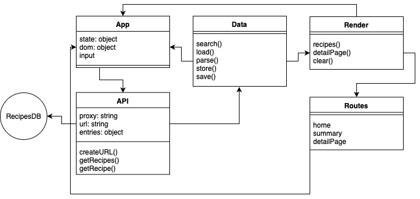
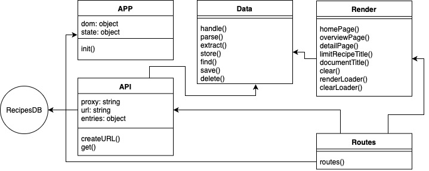
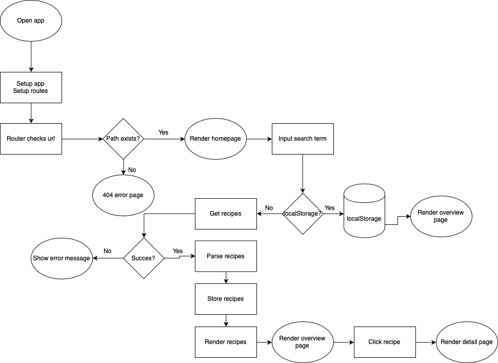
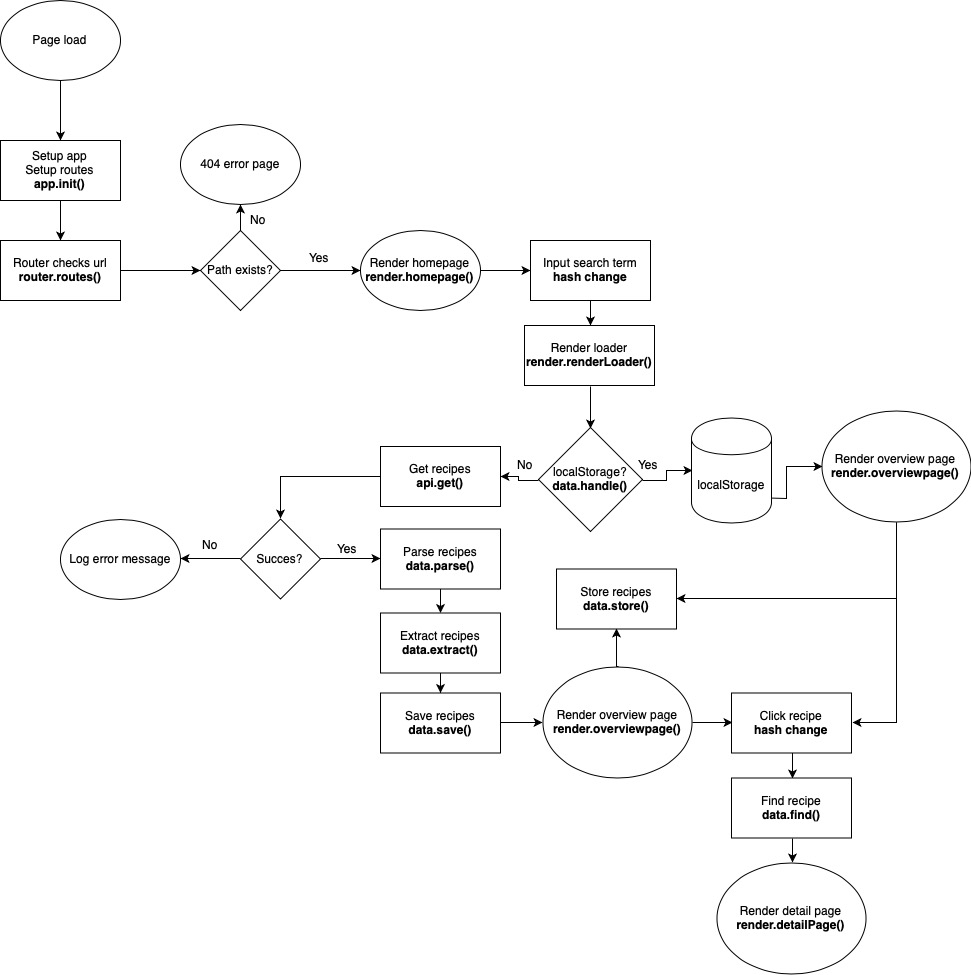

# RECIPE API SEARCHER

## Summary
A single page Web App from Scratch without any major libraries. The only library that i use in my App is the [Routie Library](http://projects.jga.me/routie/).
With my application you can search for different types of recipes that are coming from the Edamam website. If you search for ‘Pizza’ for example, you get the first 20 results that are the most relevant. When clicking on one of the recipes, you get all the ingredients that are needed to make it.

## Table of contents
1. [Live demo](#1-Live-demo)
2. [Installation](#2-Installation)
3. [Functionality](#3-Functionality)
4. [API](#4-API)
5. [Actor Diagram](#5-Actor-Diagram)
6. [Interaction Diagram](#6-Interaction-Diagram)
7. [Design and design patterns](#7-Design-and-design-patterns)
8. [Future fuctionality](#8-Future-fuctionality)

## 1. Live demo
[Link to Recipe searcher](https://tjebbemarchand.github.io/tjebbe-wafs.github.io/app/)

## 2. Installation
Beacause i don't use any dependencies, you can just fork it from my repository and clone it from you repository.
Launch the app folder in a live server package and starts working.
```bash
git clone https://github.com/your-user-name/tjebbe-wafs.github.io.git/app
```

## 3. Functionality
- Homepage with a search form for any type of recipe.
- Overview page with all the search results.
- When clicking on one of the search results. You get a detail page with all the ingredients, calories etc.
- Basic routie functionality for navigation the different pages.

## 4. API
This application uses the [Edamam API](https://developer.edamam.com/edamam-recipe-api). The API returns all the recipes associated with the search result. From here i filterd the data for what i needed.

By default you get the first 10 results back. However if you change the &from and &to paramters you can define wich data you get. 
The application uses the free version of the API. A disadvantage is you can do 5000 requests per month or only 5 requests per minute. You need to make an account to get your own app_id and app_key codes to use the application.

Connect with the API
```js
// Fetch all artobjects, 20 at a time. add &ps=NUMBER to load in more at a time
const response = await fetch('https://api.edamam.com/search?&q=pizza&app_id=YOUR_APP_ID&app_key=YOUR_APP_KEY');

if (response.status >= 200 && response.status < 400) {
    // Do something with the data
    // Return the data
} else {
    throw new Error('Unable to get the recipes');
}
```

## 5. Actor Diagram
Below you will find all the actors and functions in use in my application.
<details>
<summary>First iteration</summary>


</details>

<details>
<summary>Second iteration</summary>


</details>

## 6. Interaction Diagram
As you open the application you get a form where you can fill in all sorts of recipes. If you search for pizza for existence, you get all the recipes where pizza is the main dish. When clicked on a random recipe, all the information about the recipe renders on the screen. Like the ingredients, calories etc.

<details>
<summary>First iteration</summary>


</details>

<details>
<summary>Second iteration</summary>


</details>

## 7. Design and design patterns
### Design
I gave the app i nice design to use for the user. As you open the page you get a homepage with a search form. Here you can fill in whatever type of recipe you want to find. If clicked on search, a loading indicator pop ups on the screen to let the user know the app is getting the data from the API. On the next page you get a overview page with all the search results ordered by default by the API. SORT FILTER
If you click on one of the recipes an detail page comes up with all the recipe details like the ingredients, calories etc.

### Design patterns
The app is split up in different files all imported on the right places where it's needed. At the time of writing this README, all the functions are in object literals and the whole object literal is exported to different files. In the future i want to delete the object literals and use standard functions. The functions can be exported one by one to give it more a privatly environment.
Where the app needs to wait for an line to finish, i used an Async / Await function to do that.

## 8. Future fuctionality
I have some ideas to add in the future if i want to develop this application futher.
* Shopping list
  * Maybe i can add some sort of shopping list where all the ingredients for a particular recipe are saved in. Where you can delete the ingredients you already owned at home.
* Food lockup
  * For existence when clicked on a ingredient you get all of the information about the ingredient itself.
* Account creation
  * If an account is made, you can store saved recipes or save the shopping list as my first idea.