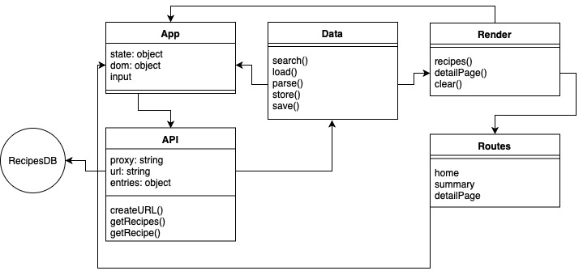

# Week 1 - Hello API 🐒

## Link to demo
[Link to Recipe searcher!](https://tjebbemarchand.github.io/tjebbe-wafs.github.io/app/)

## What does this app do?
With my application you can search for different types of recipes that are coming from the Edamam website. If you search for ‘Pizza’ for example, you get the first 10 results that are the most relevant. When clicking on one of the recipes, you get all the ingredients that are needed to make that meal.

## Which actors are within my application?

## Which API do i use for my application?
This application uses the Edamam API. Edamam is offering different API’s for different use cases. For example they offering the Food Database Lookup, Food Entity Extraction, Recipe Licensing and a couple others. The application uses the free version of the API. A disadvantage is you can do 5000 requests per month or only 5 requests per minute.

## How does my application flow?
As you open the application you get a form where you can fill in all sorts of recipes. If you search for pizza for existence, you get all the recipes where pizza is the main dish. When clicked on a random recipe, all the information about the recipe renders on the screen. Like the ingredients, calories etc.

## Which design patterns and best practises did I use?
I would like to split all the functionality in different files. The search functionality in a different file in import it in the main app. Also the rendering for the recipe in a different file from the rest.
The API call is now in XHR, but i would like to change that to Async / Await in the coming two weeks.

## What would I like to add (feature wishlist / backlog)
I have some ideas to add in the future if i want to develop this application futher.
* Shopping list
  * Maybe i can add some sort of shopping list where all the ingredients for a particular recipe are saved in. Where you can delete the ingredients you already owned at home.
* Food lockup
  * For existence when clicked on a ingredient you get all of the information about the ingredient itself.
* Account creation
  * If an account is made, you can store saved recipes or save the shopping list as my first idea.
